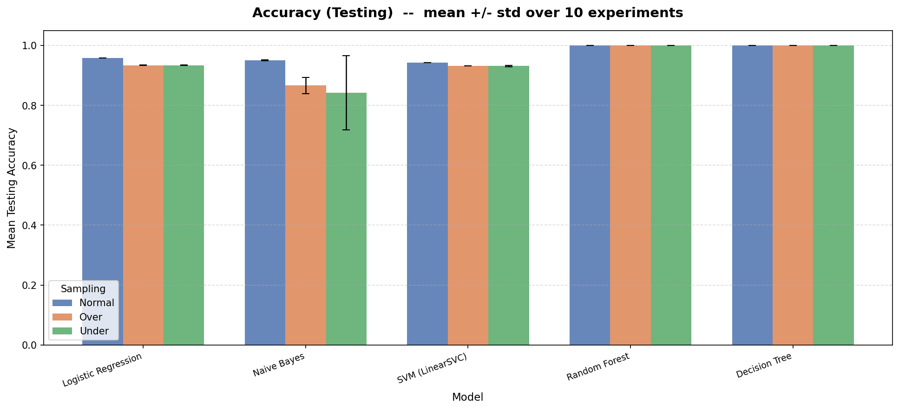
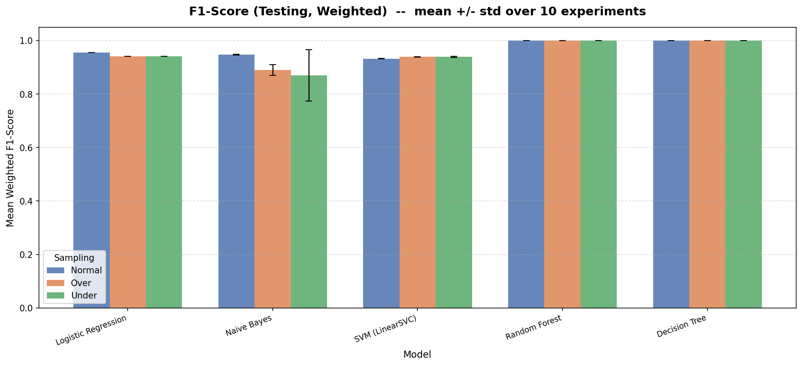
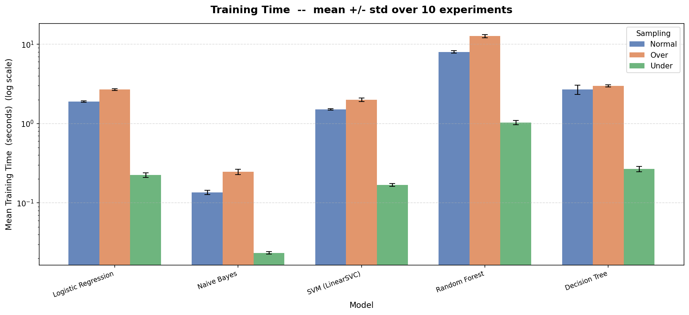
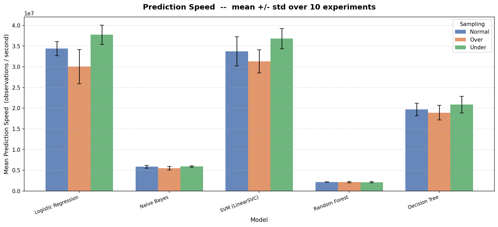
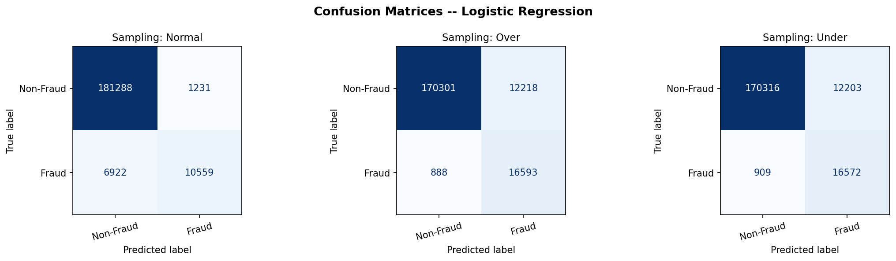
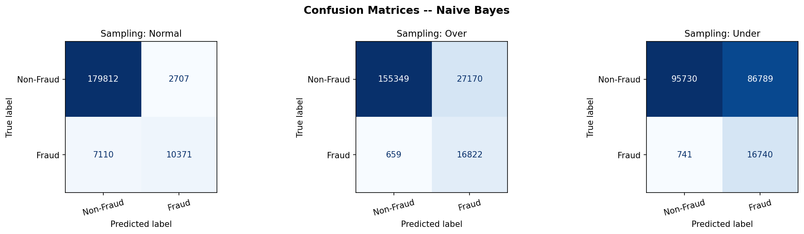
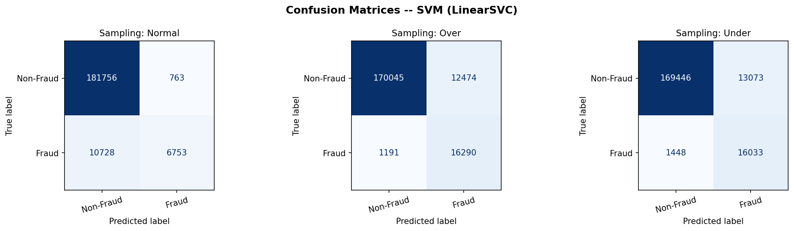
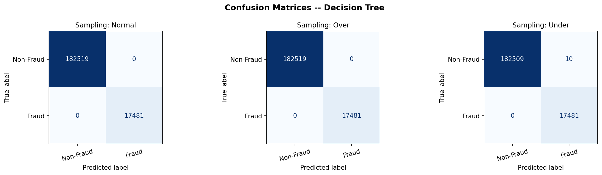

# Credit Card Fraud Detection

Dataset: Kaggle "Credit Card Fraud Detection" by Dhanush Narayanan R  
Records: about 1,000,000 transactions, target column `fraud` (8.74% positive)  
Features: 7 (3 continuous, 4 binary)

## Overview

This project compares five classifiers for detecting credit card fraud under
three sampling methods (no resampling, undersampling and oversampling). Each setup
is run 10 times with different random seeds and the mean and standard deviation
of each metric are reported.

## Why the split comes before resampling

The train/test split is done before any resampling, and only the training set is
resampled. If the whole dataset were resampled first and then split, the results
would be misleading:

| Sampling | What would go wrong if resampling came first |
|--------|----------------------------------------------|
| Oversampling | Duplicated fraud rows would end up in both the training and test sets, so the model would be tested on rows it had already seen, which inflates the scores. |
| Undersampling | The test set would be 50/50 instead of the real ~8% fraud rate, which makes the test much easier than real data. |
| Normal | No rows are added or removed, so the order doesn't matter here. |

The order used is:

```
Full dataset (1,000,000 rows)
         |
         | Stratified split (keeps ~8% fraud in both parts)
         |
   +-----+-------+
   |             |
Train set      Test set   (never resampled, stays at ~8% fraud)
(800K rows)  (200K rows)
   |
   | Apply sampling to the training set only
   |
   +-- Normal : unchanged (~8% fraud)
   +-- Under  : drop non-fraud rows -> 50/50 (140K rows)
   +-- Over   : duplicate fraud rows -> 50/50 (1.46M rows)
   |
   | Train 5 models
   | Evaluate on the same test set
   | Repeat 10 times with different seeds
```

Within each experiment all three sampling methods are evaluated on the same test set, so
the scores can be compared directly.

## A note on the scores

The dataset is synthetic and very easy to separate, so Random Forest and Decision
Tree get near-perfect scores even though the test set is never resampled. This is
expected and not a sign of leakage.

## Steps

| Step | Description |
|------|-------------|
| 1 | Load `card_transdata.csv` and check the shape and target column |
| 2 | Check data quality: types, missing values, duplicates, class balance |
| 3 | Drop duplicates/missing rows and scale the 3 continuous features with StandardScaler |
| 4-8 | Experiment loop: stratified split, resample training data, train 5 models, evaluate on the test set |
| 9 | Compute mean and std, print the summary table, plot confusion matrices and save 4 bar charts |

## Models

| Model | Notes |
|-------|-------|
| Logistic Regression | `solver='liblinear'` |
| Naive Bayes | Gaussian NB |
| SVM | `LinearSVC`, since an RBF kernel is too slow on 1M rows |
| Random Forest | 50 trees, `n_jobs=-1` |
| Decision Tree | Default settings (unpruned) |

## Sampling methods

| Sampling | Method | Training size |
|--------|--------|---------------|
| Normal | No resampling (~8% fraud) | ~800K rows |
| Under | `RandomUnderSampler` to 50/50 | ~140K rows |
| Over | `RandomOverSampler` to 50/50 | ~1.46M rows |

I used `RandomOverSampler` instead of SMOTE because SMOTE would have to generate
around 650K new rows in every experiment, which made the full run too slow. Since
the dataset is already easy to separate, this shouldn't make much difference.

## Metrics (on the test set)

| Metric | Description |
|--------|-------------|
| Testing Accuracy | Fraction of predictions that are correct |
| Testing F1-Score (weighted) | F1 weighted by class support |
| Training Time (s) | Time taken by `model.fit()` |
| Prediction Speed (obs/s) | `len(test_set) / predict_time` |

## Results (mean ± std over 10 experiments)

### Accuracy

| Model | Normal | Over | Under |
|-------|--------|------|-------|
| Logistic Regression | 0.9587 ± 0.0004 | 0.9342 ± 0.0004 | 0.9341 ± 0.0006 |
| Naive Bayes | 0.9504 ± 0.0011 | 0.8667 ± 0.0270 | 0.8417 ± 0.1240 |
| SVM (LinearSVC) | 0.9430 ± 0.0007 | 0.9322 ± 0.0007 | 0.9318 ± 0.0023 |
| Random Forest | 1.0000 ± 0.0000 | 1.0000 ± 0.0000 | 0.9999 ± 0.0000 |
| Decision Tree | 1.0000 ± 0.0000 | 1.0000 ± 0.0000 | 0.9999 ± 0.0000 |

### F1-Score (weighted)

| Model | Normal | Over | Under |
|-------|--------|------|-------|
| Logistic Regression | 0.9550 ± 0.0004 | 0.9412 ± 0.0003 | 0.9412 ± 0.0005 |
| Naive Bayes | 0.9472 ± 0.0013 | 0.8899 ± 0.0201 | 0.8699 ± 0.0960 |
| SVM (LinearSVC) | 0.9325 ± 0.0011 | 0.9393 ± 0.0006 | 0.9391 ± 0.0020 |
| Random Forest | 1.0000 ± 0.0000 | 1.0000 ± 0.0000 | 0.9999 ± 0.0000 |
| Decision Tree | 1.0000 ± 0.0000 | 1.0000 ± 0.0000 | 0.9999 ± 0.0000 |

### Training Time (seconds)

| Model | Normal | Over | Under |
|-------|--------|------|-------|
| Logistic Regression | 1.89 ± 0.04 | 2.68 ± 0.07 | 0.22 ± 0.01 |
| Naive Bayes | 0.14 ± 0.01 | 0.25 ± 0.02 | 0.02 ± 0.00 |
| SVM (LinearSVC) | 1.51 ± 0.03 | 2.00 ± 0.11 | 0.17 ± 0.01 |
| Random Forest | 8.00 ± 0.29 | 12.66 ± 0.61 | 1.03 ± 0.06 |
| Decision Tree | 2.68 ± 0.36 | 2.98 ± 0.08 | 0.27 ± 0.02 |

### Prediction Speed (observations per second)

| Model | Normal | Over | Under |
|-------|--------|------|-------|
| Logistic Regression | 34,374,349 | 30,037,249 | 37,719,204 |
| Naive Bayes | 5,849,498 | 5,509,624 | 5,906,508 |
| SVM (LinearSVC) | 33,705,975 | 31,278,728 | 36,790,784 |
| Random Forest | 2,177,953 | 2,124,613 | 2,117,171 |
| Decision Tree | 19,680,190 | 18,905,138 | 20,850,569 |

Training time and prediction speed depend on the machine, so these will vary
between runs.

### Charts






### Fraud class results (final experiment)

Recall is the fraction of actual fraud that was caught, and precision is the
fraction of flagged transactions that were actually fraud.

| Model | Sampling | Fraud Precision | Fraud Recall | Fraud F1 |
|-------|--------|-----------------|--------------|----------|
| Logistic Regression | Normal | 0.8956 | 0.6040 | 0.7215 |
| Logistic Regression | Over   | 0.5759 | 0.9492 | 0.7169 |
| Logistic Regression | Under  | 0.5759 | 0.9480 | 0.7165 |
| Naive Bayes | Normal | 0.7930 | 0.5933 | 0.6788 |
| Naive Bayes | Over   | 0.3824 | 0.9623 | 0.5473 |
| Naive Bayes | Under  | 0.1617 | 0.9576 | 0.2767 |
| SVM (LinearSVC) | Normal | 0.8985 | 0.3863 | 0.5403 |
| SVM (LinearSVC) | Over   | 0.5663 | 0.9319 | 0.7045 |
| SVM (LinearSVC) | Under  | 0.5508 | 0.9172 | 0.6883 |
| Random Forest | Normal | 1.0000 | 1.0000 | 1.0000 |
| Random Forest | Over   | 1.0000 | 1.0000 | 1.0000 |
| Random Forest | Under  | 0.9995 | 1.0000 | 0.9997 |
| Decision Tree | Normal | 1.0000 | 1.0000 | 1.0000 |
| Decision Tree | Over   | 1.0000 | 1.0000 | 1.0000 |
| Decision Tree | Under  | 0.9994 | 1.0000 | 0.9997 |

With no resampling, Logistic Regression and SVM only catch about 40-60% of fraud.
Over- or undersampling the training data raises recall to about 93-95%, but
precision drops because more normal transactions get flagged. Random Forest and
Decision Tree are perfect on this dataset regardless of the sampling method.

### Confusion matrices (final experiment)

The bottom-left cell in each matrix is the number of fraud cases that were missed.







## Files

```
├── fraud_detection.ipynb   notebook with the full pipeline
├── requirements.txt
├── README.md
└── charts/
    ├── chart_accuracy.png      testing accuracy by model and sampling
    ├── chart_f1.png            weighted F1-score by model and sampling
    ├── chart_train_time.png    training time (log scale)
    ├── chart_pred_speed.png    prediction speed
    └── confusion_*.png         confusion matrices, one per model
```

## How to run

The dataset isn't included in this repo because of its size (~73 MB). Download
`card_transdata.csv` from the
[Kaggle dataset page](https://www.kaggle.com/datasets/dhanushnarayananr/credit-card-fraud)
and put it in the same folder as the notebook.

```bash
pip install -r requirements.txt
jupyter notebook fraud_detection.ipynb
```

Then run all cells. The full run takes about 7 minutes and all the charts are
saved as PNGs in the `charts/` folder.
